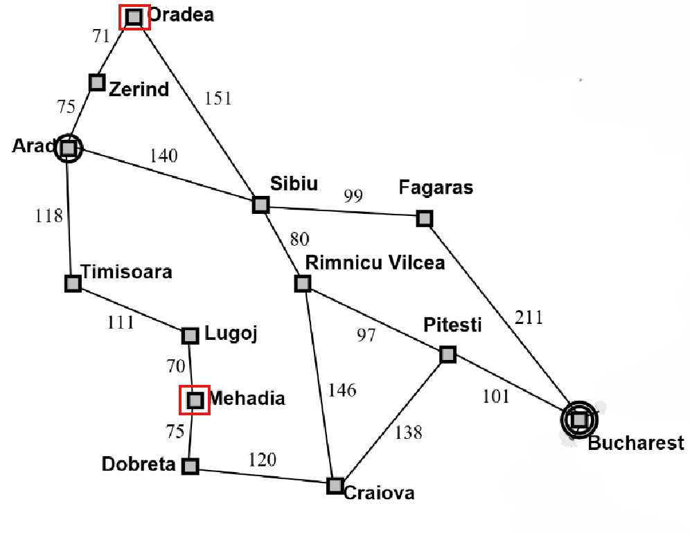

# Este reporte corresponde a la tarea: Búsqueda no informada -> Ejercicio 1.

## Elaborado por: Arianna Rodríguez Rodas

### 1. La pareja origen–destino elegida y un diagrama del subgrafo usado.

**Pareja elegida:** `Mehadia` (origen) → `Oradea` (destino).

**Subgrafo**




### 2. Una tabla comparativa con Path, Depth, Cost, Expanded (y Status en DLS).

| Algoritmo | Status | Path | Depth (carreteras) | Cost (km) | Expanded | Generated |
|---|---|---|---|---|---|---|
| BFS | success | Mehadia → Drobeta → Craiova → Rimnicu Vilcea → Sibiu → Oradea | 5 | 572 | 10 | 28 |
| UCS | success | Mehadia → Lugoj → Timisoara → Arad → Zerind → Oradea | 5 | 445 | 11 | 31 |
| DFS | success | Mehadia → Drobeta → Craiova → Pitesti → Bucharest → Fagaras → Sibiu → Oradea | 7 | 895 | 10 | 28 |
| DLS (limit=2) | cutoff | — (sin solución bajo el límite) | — | — | 3 | 7 |
| DLS (limit=4) | cutoff | — (sin solución bajo el límite) | — | — | 8 | 21 |
| DLS (limit=5) | success | Mehadia → Drobeta → Craiova → Rimnicu Vilcea → Sibiu → Oradea | 5 | 572 | 9 | 25 |
| IDS | success | Mehadia → Drobeta → Craiova → Rimnicu Vilcea → Sibiu → Oradea | 5 | 572 | 26 | 69 |

### 3. Un breve reporte (media página) que responda:
**¿BFS encontró el camino con menos carreteras? ¿UCS el de menos km?**
En este caso BFS y UCS tienen la misma cantidad de carreteras hacia el destino en el reporte con success, BFS sí garantizó menos carreteras al explorar por niveles pero coincide con la misma cantidad de carreteras de UCS por el camino con menos costo de KM.

UCS es el de menos KM, es el único que encontró el camino con menor costo de KM hacia el destino versus el resto de las demás ejecuciones, sin embargo, en nodos expandidos y generados solo estuvo por debajo de IDS, se entiende este comportamiento para encontrar la mejor ruta.

**¿Por qué DFS puede devolver un camino más largo aunque el grafo sea el mismo?**
Porque ordena alfabéticamente la frontera y extrae el de menor orden alfabético. Sigue explorando por los nodos que ya expandió, no busca la mejor ruta. Dejando de esta manera una ruta basada en la profundidad y orden alfabético.

**¿Con qué --limit DLS pasó de cutoff a solución, y cómo se relaciona eso con la profundidad del camino de BFS/IDS?**
Con limit 5 es success, al probar limit 2 y 4 da cutoff. El limit 5 para DLS coincide con Depth de BFS e IDS. La relación que tienen es que el limit 5 (que resuelve con success) es el Depth igual al de IDS y BFS para llegar al destino. IDS y BFS coinciden con 5 en Depth.


### 4. Evidencias de haber ejecutado los cinco algoritmos.

**BFS — `ejecucion_02_breadth_first_search.txt`**

```text
Algorithm: Breadth-first search
Problem:   Mehadia → Oradea
Status:    success
Path:      Mehadia → Drobeta → Craiova → Rimnicu Vilcea → Sibiu → Oradea
Depth:     5 roads
Cost:      572 km
Expanded:  10 nodes
Generated: 28 nodes
Frontier:  max size 5
```

**UCS — `ejecucion_03_uniform_cost_search.txt`**

```text
Algorithm: Uniform-cost search
Problem:   Mehadia → Oradea
Status:    success
Path:      Mehadia → Lugoj → Timisoara → Arad → Zerind → Oradea
Depth:     5 roads
Cost:      445 km
Expanded:  11 nodes
Generated: 31 nodes
Frontier:  max size 5
```

**DFS — `ejecucion_04_depth_first_search.txt`**

```text
Algorithm: Depth-first search
Problem:   Mehadia → Oradea
Status:    success
Path:      Mehadia → Drobeta → Craiova → Pitesti → Bucharest → Fagaras → Sibiu → Oradea
Depth:     7 roads
Cost:      895 km
Expanded:  10 nodes
Generated: 28 nodes
Frontier:  max size 7
```

**DLS (limit=2) — `ejecucion_05_depth_limited_search-limit2.txt`**

```text
Algorithm: Depth-limited search
Problem:   Mehadia → Oradea
Status:    cutoff
Detail:    limit=2
Expanded:  3 nodes
Generated: 7 nodes
Frontier:  max size 4
```

**DLS (limit=4) — `ejecucion_05_depth_limited_search-limit4.txt`**

```text
Algorithm: Depth-limited search
Problem:   Mehadia → Oradea
Status:    cutoff
Detail:    limit=4
Expanded:  8 nodes
Generated: 21 nodes
Frontier:  max size 7
```

**DLS (limit=5) — `ejecucion_05_depth_limited_search-limit5.txt`**

```text
Algorithm: Depth-limited search
Problem:   Mehadia → Oradea
Status:    success
Detail:    limit=5
Path:      Mehadia → Drobeta → Craiova → Rimnicu Vilcea → Sibiu → Oradea
Depth:     5 roads
Cost:      572 km
Expanded:  9 nodes
Generated: 25 nodes
Frontier:  max size 9
```

**IDS — `ejecucion_06_iterative_deepening_search.txt`**

```text
Algorithm: Iterative deepening search
Problem:   Mehadia → Oradea
Status:    success
Detail:    last_limit=5
Path:      Mehadia → Drobeta → Craiova → Rimnicu Vilcea → Sibiu → Oradea
Depth:     5 roads
Cost:      572 km
Expanded:  26 nodes
Generated: 69 nodes
Frontier:  max size 9
```
