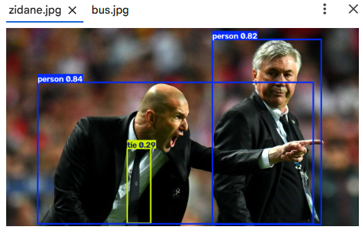
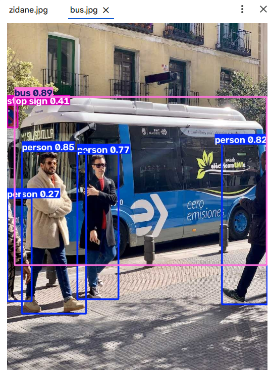
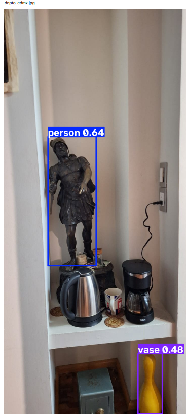
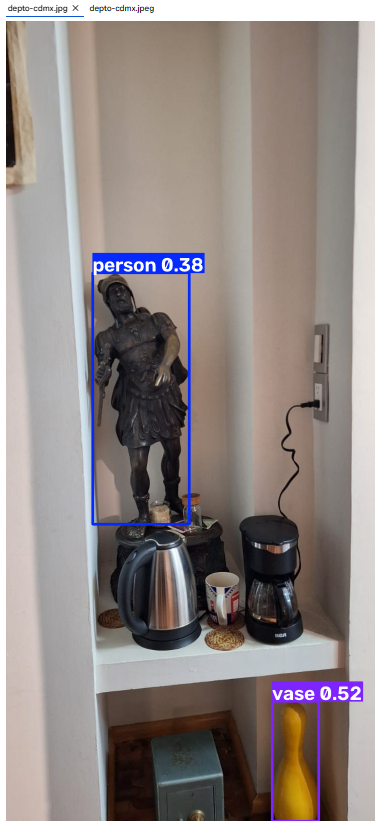
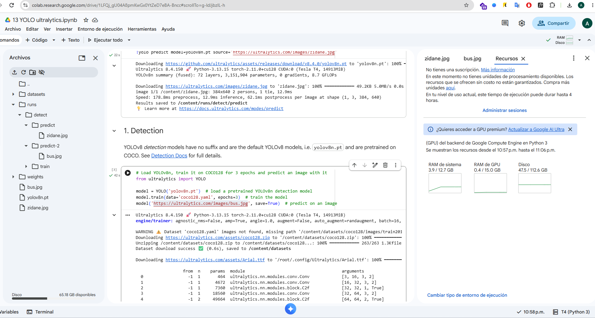

# Este reporte corresponde a la tarea: Visión computacional -> Ejercicio 1.

## Elaborado por: Arianna Rodríguez Rodas

### 1. Enlace de Colab (o el .ipynb modificado) con la corrida original y la predicción sobre mi imagen.

Enlace: [13 YOLO ultralytics.ipynb](https://colab.research.google.com/drive/1LFQj_gU04A8pmKwGx0YtZeD7eBA-Bncc?usp=sharing)

### 2. Capturas: salida sobre `zidane.jpg`, sobre `bus.jpg` y sobre tu foto.

**Original**

Predicción sobre `zidane.jpg` (detectó: 2 personas, 1 corbata)

Predicción sobre `bus.jpg` (detectó: 4 personas, 1 bus, 1 señal de alto)

**Mi imagen**

Predicción por CLI (`!yolo predict ...`)

Predicción por Python (`model(..., save=True)`)

### 3. Reporte

**¿Qué clases detectó YOLO en las fotos de Ultralytics y cuáles en la tuya?**

- En `zidane.jpg`: 2 personas y 1 corbata (person, tie).
- En `bus.jpg`: 4 personas, 1 autobús y 1 señal de alto (person, bus, stop sign).
- En mi imagen (`depto-cdmx.jpeg`): 1 persona y 1 jarrón (person, vase). La clase "person" corresponde en realidad a la estatua del guerrero romano, y "vase" al pino de boliche amarillo.

**¿Algún objeto evidente de tu foto NO salió etiquetado? ¿Por qué podría pasar (clase que no está en COCO, objeto chico, recorte, umbral de confianza)?**

Sí, varios objetos evidentes no fueron etiquetados:

- La tetera plateada y la cafetera negra: COCO no tiene esas clases exactas ("kettle" ni "coffee maker" no existen entre las 80 clases), así que YOLO no puede nombrarlas.
- La taza blanca: aunque "cup" sí es una clase de COCO, no la detectó. Probablemente porque es un objeto chico, en penumbra y parcialmente tapado, y su confianza quedó por debajo del umbral por defecto (conf=0.25).

Además hubo dos detecciones que son más bien "errores" interpretables: la estatua se etiquetó como "person" (COCO no tiene "estatua", así que la asoció a lo más parecido por su silueta humana) y el pino de boliche se etiquetó como "vase" (por su forma alargada y redondeada).

**¿La predicción de la celda CLI y la de `model(...)` coinciden sobre tu misma imagen?**

Sí, coinciden. Ambas detectaron exactamente las mismas dos clases sobre mi imagen: 1 person y 1 vase. Tiene sentido, porque las dos usan el mismo modelo (yolov8n.pt) y el mismo umbral de confianza por defecto sobre la misma imagen; solo cambia la forma de invocarlo.

### 4. Evidencia de haber ejecutado en Colab (idealmente con GPU).

